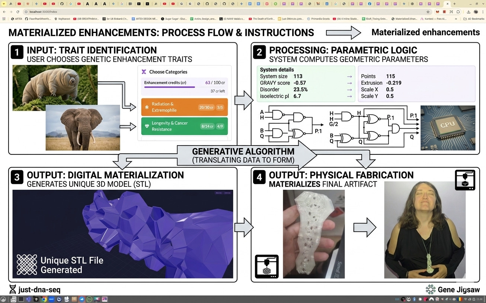

# Materialized Enhancements

**CODAME ART+TECH 『 The New Human 』 Hackathon & Festival · Milano · 2026**

> *A platform translating human biological upgrades into generative, wearable art. Choose your real-world genetic enhancements, and our system generates a unique, 3D-printable artifact shaped by your biological choices.*

---

## Team

- **Newton Winter** — web app, jigsaw generation, geometry optimization, devops, biology, UI — [GitHub @winternewt](https://github.com/winternewt)
- **Anton Kulaga** — concept, biology, UI design, generative video, 3D printing — [GitHub @antonkulaga](https://github.com/antonkulaga)
- **Livia Zaharia** — parametric geometry, personalized enhancement report, 3D printing — [livia.glucosedao.org](http://livia.glucosedao.org/)
- **Marko Prakhov-Donets** — video editing

The project is **open source** ([repository](https://github.com/winternewt/materialized-enchancements)) and built so other artists can plug their own generative models into the same biological input engine.

---

## What is this?

Upgrading human DNA isn't sci-fi — it is already happening in adults today. In alternative jurisdictions like Prospera, medical tourists are actively receiving gene therapies for muscle growth (Follistatin) and blood vessel creation (VEGF). But what happens in 10 years as we unlock harder-to-implement targets to shape "The New Human"? Nature already has the code for extreme survival: shark longevity, tardigrade radiation shields, and axolotl regeneration.

**Materialized Enhancements** turns this impending synthetic biology into participatory artwork. Users select their desired "enhancement genes" through our intuitive UI. These selections, combined with a personal digital signature, act as the exact data inputs for a generative algorithm. The result is a single, unrepeatable 3D form — ready for 3D printing.

We built this as a highly extensible platform. We are actively inviting other artists to plug their own generative art models into our biological input engine.

---

## How it works

The repository implements this pipeline: you choose enhancement traits in the UI, the backend combines gene data with a personal signature to drive parametric geometry, the app exports a unique STL (and report), and the form is ready for 3D printing or downstream tools such as ARTEX.



---

## Gene Library

35 genes · 9 categories · ~25 source organisms spanning bacteria to extinct hominins.

| Category | Genes |
|---|---|
| Radiation & Extremophile | 5 |
| Longevity & Cancer Resistance | 10 |
| Biological Immortality & Regeneration | 3 |
| Immunity & Physiology | 5 |
| Sleep & Consciousness | 1 |
| New Senses | 5 |
| Display & Expression | 3 |
| Energy | 2 |
| Materials | 1 |

---

## The Hackathon Journey

This project was literally built on the move across over 1,500 kilometers. We pitched the concept during the first hour of the hackathon in Milan, caught a flight to Bucharest, and developed the Reflex code and Grasshopper logic on a train to Munich, where Livia is currently exhibiting her "Data as Art" work.

---

## Running

```bash
uv run start           # development mode (hot-reload, separate frontend/backend ports)
uv run start --dev     # development mode + developer-only UI (ARTEX API config panel)
uv run serve           # production mode (single-port, Reflex 0.9+ unified server)
```

Copy `.env.template` to `.env` to override defaults (ARTEX endpoints, kiosk redirects, idle timeout). For production, set `REFLEX_API_URL` to your public domain in `.env`.

---

## ARTEX Venue Integration

Both the **Sculpture** and **Jigsaw** tabs have a **Send to Wall** button. One click
publishes the generated STL to the [ARTEX Platform API](https://github.com/CODAME/artex-open/tree/main/.services/artex-platform-api)
as a zipped artwork package and pushes it to a physical venue display over SSE in real
time. Full details: [`docs/ARTEX_INTEGRATION.md`](docs/ARTEX_INTEGRATION.md).

### Pipeline

```
STL bytes  →  zip(config/artwork.json + state.json + models/<file>.stl)
           →  PUT  /api/packages/:id            (upload zip)
           →  POST /admin/dev-session           (exchange admin token → session token)
           →  POST /publish/apply               (register slug)
           →  POST /api/venue/displays/:id/load-slug  (push to display via SSE)
           →  optional ?redirect= redirect
```

### Kiosk URL parameters

A QR code in the room (or the wall display's own redirect) can seed the visitor's
session with these query parameters on any page:

| Parameter | Example | Effect |
|-----------|---------|--------|
| `from=ARTEX` | `?from=ARTEX` | Makes the Send to Wall button visible |
| `token=<value>` | `?token=abcd` | Overrides the admin token for this session |
| `display_id=<id>` | `?display_id=north-wall` | Target display (overrides env) |
| `redirect=<url>` | `?redirect=https://artex.live/` | Enables idle timer + post-publish redirect. Supports `{slug}` substitution. `redirect=false` disables both. |

**Example kiosk URL:**
```
http://my-installation.example/materialize?from=ARTEX&display_id=north-wall&redirect=https://artex.live/
```

### Idle timer

When `?redirect=<url>` is present, a fixed countdown band appears at the top of
every page. It resets on any mouse, keyboard, or touch activity, turns red in the
last 5 seconds, and navigates to the redirect URL at zero. Pure client-side JS —
no server round-trip.

### Local test stand

```bash
# 1. Start Platform API (in ARTEX repo)
npm run platform-api          # → http://127.0.0.1:8787

# 2. Start runtime display (in ARTEX repo)
VITE_PLATFORM_API_URL=http://127.0.0.1:8787 VITE_DISPLAY_ID=test-wall bun run dev:runtime
# Open: http://localhost:4173?mode=gallery&displayId=test-wall&apiBase=http://127.0.0.1:8787

# 3. Start this app and send to the wall
uv run start
# Navigate to: http://localhost:3000/materialize?from=ARTEX&display_id=test-wall&redirect=false
```

### Configuration

See [`.env.template`](.env.template) for the full list.

| Variable | Default | Purpose |
|---|---|---|
| `ARTEX_API_URL` | `http://127.0.0.1:8787` | Platform API base (no trailing slash) |
| `ARTEX_API_TOKEN` | `abcd` | Admin token (`ARTEX_PLATFORM_ADMIN_TOKEN` on API server) |
| `ARTEX_DISPLAY_ID` | `test-wall` | Default venue display; overridden by `?display_id=` |
| `ARTEX_IDLE_URL` | `https://artex.live/` | Idle-redirect target in prod |
| `ARTEX_DEV_REDIRECT_URL` | `http://127.0.0.1:8787/public/projects/{slug}` | Dev-mode redirect (supports `{slug}`) |
| `IDLE_TIMEOUT_SECONDS` / `IDLE_WARNING_SECONDS` | `60` / `5` | Kiosk timer tuning |

### Testing

```bash
# Unit tests (mocked HTTP, no server needed)
uv run pytest tests/test_artex.py -v          # 9 tests, ~0.1 s

# Integration tests (auto-skipped if API is down)
uv run pytest tests/test_artex_integration.py -v -s
# Runs 4 tests: sculpture, jigsaw, display list, real-STL round-trip
```

---

## Tech Stack

- **Frontend UI**: [Reflex](https://reflex.dev/) (Python-based reactive web framework) + Fomantic UI
- **Generative Form Prototype**: Rhino / Grasshopper
- **Future Generative Engine**: Open-source generative models integrated with the UI
- **Generative Video**: Google Flux / Veo
- **Publishing Target**: [ARTEX Platform API](https://github.com/CODAME/artex-open) (REST + WebSocket) for shipping Totems to running installations
- **Data**: Polars, reflex-mui-datagrid
- **Dependency management**: uv, python-dotenv

---

## Attributions & Acknowledgements

### Jigsaw Pipeline Tools

- **[CustomShapeJigsawJs](https://github.com/proceduraljigsaw/CustomShapeJigsawJs)** by ProceduralJigsaw — Voronoi-tessellation jigsaw puzzle generator with custom SVG border support. Used to turn organism silhouettes into laser-cuttable / 3D-printable puzzle pieces. MIT License.
- **[svg_extrude](https://github.com/deffi/svg_extrude)** by deffi — Creates 3D models (suitable for 3D printing) from SVG files via OpenSCAD. Used to extrude jigsaw SVGs into printable 3MF/STL models. AGPL-3.0 License.

### PhyloPic

Organism silhouette artwork used in the puzzle-piece visualisation is sourced from **[PhyloPic](https://www.phylopic.org/)** — a free, open database of life-form silhouettes in the public domain or under open licenses.

Taxon–SVG mapping is maintained in [`animals_phylopic.md`](animals_phylopic.md).

#### Silhouettes with specific attribution requirements

The following silhouettes carry licenses that require crediting the contributor. All changes from the original (e.g. recolouring, rescaling, puzzle-piece masking) are indicated where applicable. Full UUIDs and taxon notes are in [`animals_phylopic.md`](animals_phylopic.md).

| Silhouette | Taxon | Contributor | License |
|---|---|---|---|
| Tardigrade | *Tardigrada* | Mali'o Kodis (image from the Smithsonian Institution) | [CC BY-NC-SA 3.0](https://creativecommons.org/licenses/by-nc-sa/3.0/) |
| Deinococcus | *Deinococcus radiodurans* | Matt Crook | [CC BY-SA 3.0](https://creativecommons.org/licenses/by-sa/3.0/) |
| Bowhead Whale | *Balaena mysticetus* | Chris Huh | [CC BY-SA 3.0](https://creativecommons.org/licenses/by-sa/3.0/) |
| Immortal Jellyfish | Leptomedusae | Joseph Ryan (photo: Patrick Steinmetz) | [CC BY-SA 3.0](https://creativecommons.org/licenses/by-sa/3.0/) |
| Bottlenose Dolphin | *Tursiops truncatus* | Chris Huh | [CC BY-SA 3.0](https://creativecommons.org/licenses/by-sa/3.0/) |
| Roundworm | *Caenorhabditis elegans* | Gareth Monger | [CC BY 3.0](https://creativecommons.org/licenses/by/3.0/) |
| Water-holding Frog | Anura | T. Michael Keesey (after Auckland Museum) | [CC BY 3.0](https://creativecommons.org/licenses/by/3.0/) |
| European Robin | *Erithacus rubecula* | Rebecca Groom | [CC BY 3.0](https://creativecommons.org/licenses/by/3.0/) |
| Cuttlefish | *Sepia officinalis* | David Sim (photo) & T. Michael Keesey (vectorization) | [CC BY 3.0](https://creativecommons.org/licenses/by/3.0/) |
| Firefly | *Photinus pyralis* | Melissa Broussard | [CC BY 3.0](https://creativecommons.org/licenses/by/3.0/) |
| **Weddell Seal** | ***Leptonychotes weddellii*** **(Lesson 1826)** | **Gabriela Palomo-Munoz** | **[CC BY 4.0](https://creativecommons.org/licenses/by/4.0/)** |

> The Tardigrade silhouette is **CC BY-NC-SA 3.0** — non-commercial use only. If this project is ever used commercially, a replacement CC0 silhouette must be substituted.

All remaining silhouettes are CC0 (public domain dedication) and require no credit. Consult [`animals_phylopic.md`](animals_phylopic.md) for the full per-taxon breakdown including PhyloPic image UUIDs.
