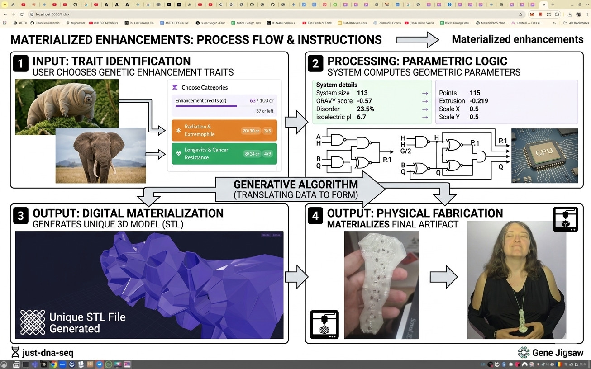

# Materialized Enhancements

> **Build your post-human character from real genes — tardigrade radiation shields, naked-mole-rat cancer resistance, Greenland shark longevity — backed by scientific evidence tiers and real citations — and 3D-print the result.**

An RPG-style character creator for speculative human enhancement. Spend enhancement credits on real genes from extraordinary organisms, watch your profile light up by category, then materialize the result as a unique 3D-printable artifact and a personal enhancement report.

**[Try it live](https://enhancement.bio/)** · [Project video](https://youtu.be/ev726lz5sLo) · [Gene knowledge base](https://www.dolthub.com/repositories/longevity-genie/enhancement-bio) · [Open source](https://github.com/winternewt/materialized-enchancements)

---

## Why this exists

Upgrading human DNA is not science fiction — it is already happening in adults today. In alternative jurisdictions like Prospera, medical tourists are actively receiving gene therapies for muscle growth (Follistatin) and blood vessel creation (VEGF). The next decade will bring harder questions about what traits people might choose. Nature has already evolved extreme survival modules: tardigrade radiation shields, whale DNA repair, axolotl regeneration, bat immune tolerance, and cephalopod expression systems.

**Materialized Enhancements** turns that biology into a playful experience. Learn real genetics along the way: every gene card cites peer-reviewed papers with DOIs, shows a tiered evidence grade (T2–T6), and is upfront about contradictions and translational gaps. Pick your favourites, then take home a unique souvenir — a 3D-printable form and a personal report generated from your choices.

---

## The Experience

### How to play

1. **Name your character** — pick a name for your future self.
2. **Spend enhancement credits** — browse the gene library grouped by category (Stress Resistance, Longevity & Genome, Regeneration, Environmental Adaptation, Perception, Expression). Each gene comes from a real organism and costs credits based on evidence strength.
3. **Watch your profile light up** — the human silhouette fills in by category as you build your loadout.
4. **Materialize** — generate a deterministic 3D-printable STL from the selected genes and your name. The geometry is driven by real protein properties (molecular weight, exon count, hydropathy, system size).
5. **Review and share** — inspect front/side/back captures, download STL + params, export a square PNG or A4 PDF report, and optionally create a public report link with social previews.

| Route | Tab | Purpose |
|---|---|---|
| `/` | **Character Profile** | Name your character, spend the 100 cr enhancement budget, browse the gene library |
| `/materialization` | **Materialization** | 3D viewer, STL/params downloads, report customization, PNG/PDF exports, public report link |
| `/about` | **About** | Project story, video, team, support links |

### How the 3D model works

Your name is hashed and XORed with your category bitmask to produce a unique seed. Real protein properties from your selected genes — molecular weight, exon count, GRAVY score, system size — are normalized into parameters that control a Voronoi-based parametric sculpture: radius, layer spacing, surface detail, and extrusion depth. The result is a printable STL that is deterministic and reproducible from the same inputs.



<details>
<summary><strong>Reports & sharing</strong></summary>

The Materialization tab has two link types:

- **Recreate URL** — a deterministic `/materialization?report=1&name=<b64>&cats=<bitmask>&genes=<b64-json-list>` URL that rebuilds the same character from the name, selected categories, and exact checked genes.
- **Public report link** — a generated `/generated/reports/<slug>/index.html` landing page with social metadata and downloadable artifacts.

Exports stay local until the visitor clicks **Create public link**. That action writes a public report folder with:

- `index.html` — crawler-friendly page with Open Graph/Twitter metadata
- `model.stl` — the printable sculpture
- `params.json` — strongest saved reproduction artifact, including selected categories, checked genes, sculpture parameters, and the recreate URL
- `report.webp` — square social preview card (WebP for smaller size with transparency)
- `report.pdf` — A4 personal enhancement report

QR, copy, and social sharing buttons use the public report link after it exists. Before publication, the PDF still embeds the recreate URL so the character selection can be opened again. Reports are generated in the browser using vendored JS (`html-to-image`, `jsPDF`, `qrcode`) — no server-side image dependencies.

</details>

<details>
<summary><strong>Email delivery</strong></summary>

The **Send STL + report** feature delivers the artifact bundle to the visitor's inbox via [Resend](https://resend.com). Set `RESEND_API_KEY` in `.env`. See [`.env.template`](.env.template) for full configuration.

</details>

<details>
<summary><strong>Venue & kiosk integration</strong></summary>

For physical installations, the app supports kiosk mode with ARTEX venue display integration (send sculptures to a physical display wall in real time). See [`docs/ARTEX_INTEGRATION.md`](docs/ARTEX_INTEGRATION.md) for setup, kiosk URL parameters, idle timer configuration, and the full ARTEX pipeline.

</details>

---

## Gene Knowledge Base

The gene library is more than game data — it is a curated knowledge base of real genetic enhancements backed by peer-reviewed research. Every entry includes a biological narrative, molecular mechanism, quantified achievements with DOIs, evidence tiers, confidence assessments, translational gaps, and experimental testing records across multiple organisms.

Whether you are a researcher studying gene transfer, a biohacker evaluating enhancement options, or a transhumanist tracking which therapies are already available in alternative jurisdictions — the database gives you structured, evidence-graded data to work from. We are expanding it to include providers and clinics offering gene therapies today.

109 genes · 6 parent categories · 71 source species across all 5 kingdoms of life (Animalia, Bacteria, Archaea, Fungi, Plantae) · 1,023 experimental evidence records · 729 registered clinical trials · 108 organizations (69 academic labs, 36 biotech companies, 3 clinics) · 850 unique DOI-linked references.

| Category | Genes | Example organisms |
|---|---|---|
| Longevity & Genome | 25 | Greenland shark, Naked mole-rat, African elephant, Orange roughy |
| Environmental Adaptation | 19 | Arctic ground squirrel, Electric eel, Chinese brake fern, Deep-sea bacterium |
| Expression | 17 | Crystal jellyfish, Golden silk orbweaver, Humboldt squid, Venus flower basket sponge |
| Stress Resistance | 16 | Tardigrade, Deinococcus, Desert moss, Hyperthermophilic vent archaeon |
| Regeneration | 16 | Axolotl, Planarian, Spiny mouse, Immortal jellyfish, American lobster |
| Perception | 16 | Little skate, Budgerigar, Anna's hummingbird, Corn snake, Silver spinyfin |

Each gene has an **evidence tier** (T2–T6), a **confidence level**, quantified achievements with citations, and honest notes about limitations, contradictions, and translational gaps.

### Browse, query, and contribute

The canonical knowledge base is hosted on **[DoltHub](https://www.dolthub.com/repositories/longevity-genie/enhancement-bio)** — a version-controlled SQL database (MySQL-compatible) that supports pull requests, forks, diffs, and a browser-based SQL workbench.

- **Browse and query** the data directly at [dolthub.com/repositories/longevity-genie/enhancement-bio](https://www.dolthub.com/repositories/longevity-genie/enhancement-bio)
- **Fork the database** to propose additions or corrections via DoltHub pull requests
- **Run SQL queries** in the DoltHub SQL workbench to explore genes, species, evidence, and confidence data
- **Clone locally** with `dolt clone longevity-genie/enhancement-bio` for offline analysis

A GitHub Action syncs DoltHub changes to the app repository every 6 hours — no manual intervention needed.

### Contributing a new gene

Scientists and biologists can propose new genes — **no Python code changes needed**.

**Preferred: via DoltHub** (no Git/Python needed)

1. Go to [dolthub.com/repositories/longevity-genie/enhancement-bio](https://www.dolthub.com/repositories/longevity-genie/enhancement-bio)
2. Fork the database
3. Add rows using the SQL workbench (or clone locally with `dolt clone`)
4. Open a pull request describing the new gene and its evidence
5. Once merged, the data syncs to the app automatically

<details>
<summary><strong>Alternative: via CSV files</strong> (local development)</summary>

1. **Choose a `gene_id`** — a unique snake_case slug (e.g. `klotho_overexp`, `p53_elephant`). This is the primary key used across all tables.

2. **Add the source species** to `species.csv` (skip if the species already exists):
   - Use the scientific name in snake_case as `species_id` (e.g. `elephas_maximus`)
   - Fill taxonomy columns from [AnAge](https://genomics.senescence.info/species/) or NCBI Taxonomy
   - Life-history fields are optional but enrich the species card

3. **Add the gene row** to `gene_library.csv`:
   - Assign one of the 6 parent categories and a specific subcategory (trait)
   - Write the `Narrative` (150–300 words): describe the biology, cite the strongest evidence with effect sizes, be honest about contradictions and limitations
   - Set `Highest Evidence Tier`: T7 (association only) → T6 (≥4 independent labs) → T5 (in-vivo mammal) → T4 (in-vivo non-mammal) → T3 (cell culture) → T2 (computational) → T1 (theoretical)
   - Fill all required columns (see schema below)

4. **Link gene to species** in `gene_species.csv`:
   - Add one row per source species: `gene_id,species_id`
   - Multi-species genes get multiple rows

5. **Add pricing & protein data** to `gene_properties.csv`:
   - Look up protein data from UniProt or NCBI
   - Set `gene_price` (positive integer, typically 1–15 cr)

6. **Add confidence assessment** to `gene_confidence.csv`:
   - At minimum: `gene_id,value` (e.g. `klotho_overexp,Medium-High`)

7. **Add experimental evidence** to `gene_testing.csv`:
   - One row per independent experiment/study
   - Include both positive and negative results (`positive` = `true` or `false`)

8. **Regenerate the SQLite database**: `uv run python scripts/seed_db.py`

9. **Test locally**: `uv run start` — the app should show the new gene in the correct category

</details>

#### Writing guidelines

- Be honest about contradictions and limitations — mention failed replications and tissue-specific effects
- Lead with the strongest experimental evidence and include quantified effect sizes
- End on a realistic assessment, not hype
- Use DOIs for all references

#### Integrity checks

The app enforces at startup:
- Every `gene_id` in `gene_library.csv` must have a matching row in `gene_properties.csv` with `gene_price > 0`
- Every `species_id` referenced in `gene_species.csv` must exist in `species.csv`

<details>
<summary><strong>Database schema</strong> (9 tables, entity-relationship diagram)</summary>

Gene data lives in a relational database with 9 tables (hosted on [DoltHub](https://www.dolthub.com/repositories/longevity-genie/enhancement-bio), synced to SQLite, with CSV fallback under `data/db_backup/`).

#### Entity-relationship overview

```
                    ┌──────────────────┐
                    │   genes (PK)     │
                    │──────────────────│
                    │ gene_id          │
                    │ gene, category   │
                    │ trait, narrative  │
                    │ mechanism, …     │
                    └─┬──┬──┬──┬──────┘
                      │  │  │  │
          ┌───────────┘  │  │  └───────────┐
          │              │  │              │
          ▼              │  ▼              ▼
 gene_properties         │  gene_confidence    gene_testing
 ┌───────────────┐       │  ┌──────────────┐   ┌─────────────┐
 │ gene_id  (FK) │       │  │ gene_id (FK) │   │ gene_id (FK)│
 │ protein_mass  │       │  │ value        │   │ host        │
 │ gene_price    │       │  │ argument     │   │ key_result  │
 │ …biophysical  │       │  │ description  │   │ doi, year   │
 └───────────────┘       │  └──────────────┘   └─────────────┘
        1:1              │        1:N                1:N
                         │
                         ▼
                  gene_species (bridge)
                  ┌──────────────┐
                  │ gene_id (FK) │──► genes
                  │ species_id(FK│──► species
                  │  (many:many) │
                  └──────────────┘
                         │
                         ▼
                    ┌──────────────────┐
                    │  species (PK)    │
                    │──────────────────│
                    │ species_id       │
                    │ common_name      │
                    │ sci_name         │
                    │ taxonomy, life…  │
                    └───────┬──────────┘
                            │
                            ▼
                    species_svg_map
                    ┌─────────────────┐
                    │ species_id (FK) │
                    │ ui_svg_path     │
                    │ phylopic_uuid   │
                    └─────────────────┘

                    ┌──────────────────┐
                    │  organizations   │
                    │──────────────────│
                    │ org_id           │
                    │ name, type       │
                    │ country, url     │
                    └────────┬─────────┘
                             │
                             ▼
                    organization_genes
                    ┌─────────────────┐
                    │ org_id (FK)     │──► organizations
                    │ gene_id (FK)   │──► genes
                    │ stage, delivery │
                    │ trial_id        │
                    └─────────────────┘

All 9 tables are connected through two hubs:
  genes ← gene_species → species
  genes ← organization_genes → organizations
```

#### Table: `genes` — gene metadata (source of truth)

| Column | Required | Description |
|---|---|---|
| `gene_id` | **PK** | Unique slug, e.g. `dsup`, `has2_nmr`. Used as join key everywhere. |
| `Gene` | yes | Display name, e.g. `Dsup`, `HAS2` |
| `Manipulation` | yes | How the gene is used: `Overexpression`, `Knockout`, `Base editing knockout`, etc. |
| `Category` | yes | One of 6 parent categories: `Stress Resistance`, `Longevity & Genome`, `Regeneration`, `Environmental Adaptation`, `Perception`, `Expression` |
| `Subcategory` | yes | Specific trait within the category, e.g. `Radiation Shielding`, `Hyaluronic Acid` |
| `Narrative` | yes | 150–300 word biological story. Honest about contradictions — not hype. |
| `Short Description` | yes | 1–2 sentence plain-language summary |
| `Mechanism` | yes | Molecular mechanism of action |
| `Achievements (effect sizes)` | yes | Quantified experimental results with citations |
| `Highest Evidence Tier` | yes | `T1`–`T7` (T7 = association only, T6 = ≥4 independent labs, T5 = in-vivo mammal, T4 = in-vivo non-mammal, T3 = cell culture, T2 = computational, T1 = theoretical). Compound tiers like `T4 (human U2OS cell expression) + T3 (cross-species)` are allowed. |
| `Translational Gaps` | yes | What research is still needed |
| `Key References (DOIs)` | yes | Pipe-separated `Author Year URL` entries |
| `Notes (limitations, contradictions, caveats)` | yes | Caveats, contradictions between studies, known failure modes |
| `Secondary Categories` | optional | Pipe-separated additional parent category names for cross-cutting genes |

#### Table: `species` — organism lookup

| Column | Required | Description |
|---|---|---|
| `species_id` | **PK** | Snake_case slug, e.g. `ramazzottius_varieornatus`, `heterocephalus_glaber` |
| `scientific_name` | yes | Binomial name, e.g. `Ramazzottius varieornatus` |
| `common_name` | yes | Display name, e.g. `Tardigrade`, `Naked mole-rat` |
| `genus` | yes | Taxonomic genus |
| `species` | yes | Taxonomic species epithet |
| `kingdom` | yes | e.g. `Animalia` |
| `phylum` | yes | e.g. `Chordata`, `Tardigrada` |
| `class` | yes | Taxonomic class |
| `order` | yes | Taxonomic order |
| `family` | yes | Taxonomic family |
| `max_longevity_years` | optional | Maximum recorded lifespan in years (from [AnAge](https://genomics.senescence.info/species/)) |
| `adult_weight_g` | optional | Typical adult body weight in grams |
| `metabolic_rate_w` | optional | Metabolic rate in watts |
| `body_mass_g` | optional | Body mass used for allometric scaling |
| `temperature_k` | optional | Body temperature in kelvin |
| `female_maturity_days` | optional | Days to female sexual maturity |
| `male_maturity_days` | optional | Days to male sexual maturity |
| `gestation_days` | optional | Gestation period in days |
| `imr_per_year` | optional | Initial mortality rate per year |
| `mrdt_years` | optional | Mortality rate doubling time in years |
| `url` | optional | Wikipedia or reference URL for the species |

#### Table: `gene_species` — many-to-many join

| Column | Required | Description |
|---|---|---|
| `gene_id` | **FK** | References `genes → gene_id` |
| `species_id` | **FK** | References `species → species_id` |

One row per gene–species link. Multi-species genes (e.g. a gene studied in both mouse and fly) have multiple rows.

#### Table: `gene_properties` — pricing & biophysical data

| Column | Required | Description |
|---|---|---|
| `gene_id` | **FK** | References `genes → gene_id` |
| `gene` | yes | Display name (must match `genes → gene`) |
| `protein_id` | yes | UniProt/NCBI accession |
| `id_type` | yes | `uniprot` or `ncbi` |
| `reference_protein` | yes | Protein name for the reference entry |
| `protein_length_aa` | yes | Protein length in amino acids |
| `protein_mass_kda` | yes | Protein mass in kilodaltons |
| `exon_count` | yes | Number of exons in the gene |
| `genes_in_system` | yes | Gene count in the functional system |
| `recipient_organism_count` | yes | Number of organisms this gene has been tested in |
| `disorder_pct` | yes | Intrinsic disorder percentage (0–100) |
| `isoelectric_point_pI` | yes | Isoelectric point |
| `gravy_score` | yes | GRAVY hydropathy score |
| `key_publication_year` | yes | Year of the key publication |
| `category` | yes | Parent category (must match `genes → category`) |
| `gene_price` | yes | Enhancement credit cost (positive integer) |

#### Table: `gene_confidence` — confidence assessments

| Column | Required | Description |
|---|---|---|
| `gene_id` | **FK** | References `genes → gene_id` |
| `value` | yes | Confidence level: `Low`, `Low-Medium`, `Medium-Low`, `Medium`, `Medium-High`, `High`, `Very High`, `N/A`, or `Declining` |
| `argument` | optional | Reasoning for the assessment |
| `description` | optional | Extended explanation |

Multiple rows per gene are allowed (e.g. different assessors or dimensions).

#### Table: `gene_testing` — experimental evidence records

| Column | Required | Description |
|---|---|---|
| `gene_id` | **FK** | References `genes → gene_id` |
| `host` | yes | Test organism, e.g. `Human`, `Mouse`, `C. elegans` |
| `tissue_or_system` | yes | Tissue/cell type tested, e.g. `cell_line (HEK293)`, `whole_organism` |
| `intervention` | yes | e.g. `overexpression`, `knockout`, `mRNA delivery` |
| `delivery` | yes | e.g. `stable_transfection`, `LNP`, `AAV` |
| `integration` | yes | `stable`, `transient`, `episomal` |
| `key_result` | yes | Main finding in one sentence |
| `effect_size` | optional | Quantified effect, e.g. `~50% SSB reduction at 10 Gy` |
| `positive` | yes | `true` if the result supports the gene's intended effect |
| `reference_short` | yes | Short citation, e.g. `Hashimoto 2016 Nat Commun` |
| `doi` | yes | DOI URL |
| `year` | yes | Publication year |

Multiple rows per gene — each row is one independent experiment/study.

#### Table: `species_svg_map` — organism silhouette mapping

| Column | Required | Description |
|---|---|---|
| `species_id` | **FK** | References `species → species_id` |
| `ui_svg_path` | yes | Path to the SVG silhouette in `assets/species_svg/` |
| `phylopic_uuid` | yes | PhyloPic UUID for re-downloading the silhouette |
| `license` | yes | License identifier (e.g. `CC0-1.0`, `CC-BY-4.0`) |

Plus taxonomy fields mirrored from `species` and optional `jigsaw_layer`, `similar_to`, `flag`, `notes`.

</details>

<details>
<summary><strong>How data syncs</strong> (DoltHub → SQLite → App)</summary>

```
DoltHub (longevity-genie/enhancement-bio)
    │
    │  GitHub Action polls every 6h
    │  (only syncs when commit hash changes)
    ▼
data/enhancement.db (SQLite, committed to repo)
    │
    │  gene_data.py auto-detects at startup
    ▼
App loads from SQLite (preferred) or CSV fallback
```

- `.github/workflows/sync-dolthub.yml` — polls DoltHub every 6h, clones, exports to SQLite via `db-to-sqlite` + `pymysql`, commits if changed
- `data/.dolthub-hash` — stores the latest DoltHub commit hash; the sync action skips work when unchanged
- `scripts/seed_db.py` — regenerates `data/enhancement.db` from CSV files locally: `uv run python scripts/seed_db.py`

</details>

---

## Development

<details>
<summary><strong>Running locally</strong></summary>

```bash
git lfs install        # one-time: enable Git LFS (PDB + STL files)
git lfs pull           # fetch binary assets if cloned without LFS
uv run start           # development mode (hot-reload)
uv run serve           # production mode (single-port, Reflex 0.9+)
```

Copy `.env.template` to `.env` to override defaults (email delivery, deploy URL, kiosk settings, and post-materialization community links). For production, set `DEPLOY_URL` to your public domain so QR codes, report links, and social shares use absolute URLs.

Useful optional overrides:

- `DISCORD_INVITE_URL` controls the Discord CTA shown only after a visitor generates their materialization artifacts. Set it to an empty value to hide the CTA.
- `DISCORD_COMMUNITY_NAME` controls the display name in that post-generation invite.
- `GITHUB_PROJECT_URL` controls the post-generation GitHub CTA for stars, bug reports, and improvement suggestions. Set it to an empty value to hide the CTA.
- `DONATION_URL` controls the post-generation donation/support CTA. Set it to an empty value to hide the CTA.

</details>

<details>
<summary><strong>Mobile testing (Android via USB)</strong></summary>

Enable Developer Options on the phone (Settings → About phone → Software information → tap Build number 7×), then enable USB debugging. Connect with a data-capable USB cable and authorize when prompted.

```bash
adb devices                                # verify "device" (not "unauthorized")
adb reverse tcp:3000 tcp:3000              # frontend → phone can reach localhost:3000
adb reverse tcp:8000 tcp:8000              # backend WebSocket
adb shell svc power stayon usb             # keep screen on while USB connected
adb shell am start -a android.intent.action.VIEW -d "http://localhost:3000/" com.android.chrome
```

If another app occupies port 3000, use alternate ports:

```bash
uv run preselect --frontend-port 3001 --backend-port 8001
adb reverse tcp:3001 tcp:3001 && adb reverse tcp:8001 tcp:8001
```

Take screenshots with `adb exec-out screencap -p > screenshot.png`. For AI-assisted debugging, forward Chrome DevTools via `adb forward tcp:9222 localabstract:chrome_devtools_remote` and connect the [Chrome DevTools MCP](https://github.com/ChromeDevTools/chrome-devtools-mcp).

</details>

<details>
<summary><strong>Binary assets (Git LFS)</strong></summary>

Protein structure files (`assets/structures/*.pdb`) and 3D-printable STL meshes (`assets/stl/*.stl`) are tracked with [Git LFS](https://git-lfs.com/). After cloning, run `git lfs pull` to download them. To regenerate STLs from PDB sources: `uv run stl generate --all`. For optimized 3D printing profiles, see Marius Mihasan's [3DP-Jmol printing profiles](https://github.com/mariusmihasan/3DP-Jmol-3D-printing-profiles) and his [Modele Moleculare](https://modelemoleculare.ro/) project.

</details>

---

## Team

- **Newton Winter** — web app, RPG interface, geometry optimization, devops, biology, UI — [GitHub @winternewt](https://github.com/winternewt)
- **Anton Kulaga** — concept, biology, knowledge base, UI design, generative video, 3D printing — [GitHub @antonkulaga](https://github.com/antonkulaga)
- **Livia Zaharia** — parametric geometry, personalized enhancement report, 3D printing — [livia.glucosedao.org](http://livia.glucosedao.org/)

### Contributors

- **Marko Prakhov-Donets** — video editing
- **Laura Radulescu** — UI fixes (overlapping info, icon alignment), fast gene removal, materialize pop-ups — [GitHub @LauraR20](https://github.com/LauraR20)

Started at CODAME ART+TECH 『 The New Human 』 in Milano, now developed by the joint [GlucoseDAO](https://glucosedao.org) and [Longevity Genie](https://longevity-genie.info) team.

The project is **open source** ([repository](https://github.com/winternewt/materialized-enchancements)) and built so other artists can plug their own generative models into the same biological input engine.

### Gratitudes

- **[Marius Mihasan](https://modelemoleculare.ro/)** — 3D molecular printing expertise, open-source [3DP-Jmol printing profiles](https://github.com/mariusmihasan/3DP-Jmol-3D-printing-profiles) used for protein structure printing guidance
- **[hidoba](https://github.com/hidoba)** — interface advice and help with Milan Design Week

---

## Tech Stack

- **Frontend**: [Reflex](https://reflex.dev/) + Fomantic UI (RPG-style character builder)
- **Data**: SQLite database (synced from [DoltHub](https://www.dolthub.com/repositories/longevity-genie/enhancement-bio)) with CSV fallback; Polars for CSV loading
- **Database sync**: [Dolt](https://www.doltdb.com/) version-controlled database on DoltHub, GitHub Action for automated sync
- **3D generation**: Python parametric geometry pipeline (`sculpture.py`)
- **Reports**: browser-side `html-to-image`, `jsPDF`, QR generation
- **Email**: [Resend](https://resend.com) HTTPS API
- **Venue**: [ARTEX Platform API](https://github.com/CODAME/artex-open) (optional)
- **Deps**: uv, python-dotenv

---

## Attributions

Organism silhouette artwork is sourced from [PhyloPic](https://www.phylopic.org/). The canonical per-species silhouettes live in `assets/species_svg/`; provenance and per-file attribution requirements are documented in [`docs/species_svg_attribution.md`](docs/species_svg_attribution.md) (machine-readable map: [`data/input/species_svg_map.csv`](data/input/species_svg_map.csv)).

Jigsaw prototype tools: [CustomShapeJigsawJs](https://github.com/proceduraljigsaw/CustomShapeJigsawJs) (MIT), [svg_extrude](https://github.com/deffi/svg_extrude) (AGPL-3.0).
