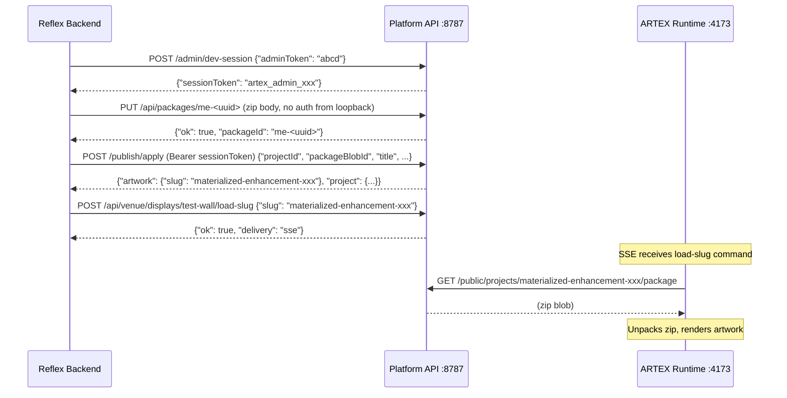

# ARTEX Venue Integration Refactor

## Critical Finding: API Mismatch

The existing [`artex.py`](src/materialized_enhancements/artex.py) targets endpoints that **do not exist** on the running ARTEX Platform API:

- `POST <api>/projects` -- not an endpoint
- `PUT <api>/projects/:id/assets/models/:filename` -- not an endpoint
- `POST <api>/projects/:id/run` -- not an endpoint

The real Platform API (at `http://127.0.0.1:8787`) uses a completely different publish pipeline. The entire `publish_stl_sync` / `create_artex_project_sync` layer must be rewritten.

---

## Real Publish-to-Display Pipeline

The ARTEX runtime's `SlugLoader` (in `ARTEX/apps/runtime/src/App.tsx`) only handles `load-slug` SSE commands, not `load-package`. So we **must** go through the full publish flow to get a slug:



**Auth notes:**
- Package upload (`PUT /api/packages/:id`) needs no auth from loopback (127.0.0.1)
- Publish (`POST /publish/apply`) requires `Authorization: Bearer <sessionToken>` -- token obtained from `/admin/dev-session`
- Venue push (`POST /api/venue/displays/:id/load-slug`) needs no auth
- The "token" the user passes (`?token=abcd` / env `ARTEX_API_TOKEN`) is the **admin token** (`ARTEX_PLATFORM_ADMIN_TOKEN`), exchanged for a short-lived session token via the dev-session endpoint

---

## Package Format

ARTEX packages are zip files. The runtime fetches and unpacks them. Based on the test fixture at `ARTEX/.services/artex-platform-api/test-fixtures/make-venue-test-package.mjs`, the zip must contain:

- `config/artwork.json` -- artwork config (layers, assets, renderer mode, etc.)
- `state.json` -- initial runtime state
- Media files (e.g., `models/sculpture.stl`)

The existing `build_sculpture_config` / `build_jigsaw_config` produce v1 configs with `rendererMode: "three-experimental"`. These should be adapted to the v2 artwork format the runtime expects (with `assets` array, `layers` array, `states`, etc.), or tested as-is if the runtime's three-experimental renderer handles v1 configs.

---

## Changes by File

### 1. [`.env.template`](.env.template) + [`.env`](.env) -- Update Defaults

Change to match the local test stand:

- `ARTEX_API_URL=http://127.0.0.1:8787` (was `http://localhost:8080/v1`)
- `ARTEX_API_TOKEN=abcd` (was `dev-token-12345678`)
- Add `ARTEX_DISPLAY_ID=test-wall` (new, was `ARTEX_INSTANCE_ID=default`)
- `ARTEX_DEV_REDIRECT_URL=http://127.0.0.1:8787/public/projects/{slug}` (verify project exists by slug)

### 2. [`env.py`](src/materialized_enhancements/env.py) -- Config Updates

- Rename `ARTEX_INSTANCE_ID` to `ARTEX_DISPLAY_ID` (default `test-wall`)
- Keep `ARTEX_API_URL` and `ARTEX_API_TOKEN` (semantics change: token is now admin token, URL no longer has `/v1` suffix)
- Remove or repurpose `ARTEX_PROJECT_URL_TEMPLATE` (no longer redirect-to-project; redirect target comes from `?redirect=` param)
- Keep `IDLE_TIMEOUT_SECONDS`, `IDLE_WARNING_SECONDS`

### 3. [`artex.py`](src/materialized_enhancements/artex.py) -- Full API Rewrite

**Delete** `publish_stl_sync` and `create_artex_project_sync` (target nonexistent endpoints).

**New functions:**

- `_get_session_token(api_url, admin_token) -> str` -- POST `/admin/dev-session` with `{"adminToken": admin_token}`, returns `sessionToken`
- `_upload_package(api_url, package_id, zip_bytes) -> None` -- PUT `/api/packages/<package_id>` with zip body (no auth from loopback)
- `_publish_artwork(api_url, session_token, project_id, package_id, title, description) -> str` -- POST `/publish/apply` with Bearer token, returns slug
- `_push_to_display(api_url, display_id, slug) -> str` -- POST `/api/venue/displays/<display_id>/load-slug`, returns delivery status
- `build_artex_package_zip(config, state, stl_bytes, stl_filename) -> bytes` -- builds a zip in memory using `zipfile.ZipFile` with `config/artwork.json`, `state.json`, and `models/<stl_filename>`
- `publish_and_push_sync(api_url, admin_token, display_id, config, stl_bytes, stl_filename) -> Tuple[str, str]` -- orchestrates the full flow (session -> upload -> publish -> push), returns `(project_id, slug)`

**Adapt config builders** (`build_sculpture_config`, `build_jigsaw_config`) to output config in the artwork.json format the runtime expects (v2 format with `assets` array, `layers`, `states`). The existing v1 fields (`rendererMode`, `animation`, `evolution`, etc.) should be nested appropriately or tested to confirm the runtime handles them.

### 4. [`state.py`](src/materialized_enhancements/state.py) -- Query Param Handling + Display Push

**New query param handling (both ComposeState and JigsawState):**

- Read `?from=ARTEX` in `on_load` handlers or in `artex_section_visible` -- if present, force ARTEX UI visible
- Read `?token=<value>` -- if present, override `artex_api_token` state var (takes precedence over env)
- Read `?display_id=<value>` -- store as `artex_display_id` state var (falls back to env `ARTEX_DISPLAY_ID`)
- Read `?redirect=<url|false>` -- store as `artex_redirect_url` state var

**Add `artex_display_id` state var** to both `ComposeState` and `JigsawState` (default from `ARTEX_DISPLAY_ID` env).

**Rewrite `create_artex_project` / `publish_to_artex`** to call new `publish_and_push_sync` (builds package zip, uploads, publishes, pushes to display). After success, if `artex_redirect_url` is a URL (not "false"), yield `rx.redirect(url)`.

**Update `artex_section_visible`** computed var:
```python
@rx.var
def artex_section_visible(self) -> bool:
    if DEV_MODE:
        return True
    if str(self.router.url.query_parameters.get("from", "")) == "ARTEX":
        return True
    return len(self.artex_api_token.strip()) > 0
```

**Add `apply_artex_params` on_load handler** (or extend existing on_load) for both `/materialize` and `/jigsaw` routes:
```python
def apply_artex_params(self):
    params = self.router.url.query_parameters
    token = str(params.get("token", "")).strip()
    if token:
        self.artex_api_token = token
    display_id = str(params.get("display_id", "")).strip()
    if display_id:
        self.artex_display_id = display_id
    redirect = str(params.get("redirect", "")).strip()
    if redirect:
        self.artex_redirect_url = redirect
```

### 5. [`pages/index.py`](src/materialized_enhancements/pages/index.py) -- Inactivity Timer

**Client-side inactivity timer** (only when `?redirect=<url>` is present and not "false"):

- Render a visible countdown bar/banner at the top of the page
- JavaScript timer that resets on mouse/touch/keyboard activity
- When countdown reaches zero, `window.location.href = redirect_url`
- Timer visibility and behavior gated by a state var (`artex_redirect_url`)
- Use `rx.script()` for the client-side JS (consistent with existing vendored JS pattern)

The timer component should be a reusable function in `artex.py` or `pages/index.py` that receives the redirect URL from state and renders the countdown UI + JS.

### 6. [`artex.py`](src/materialized_enhancements/artex.py) -- UI Component Updates

**Update `artex_publish_button`:**
- Change label from "Publish to ARTEX" to "Send to Wall" or similar (it's now pushing to a physical display)
- After success, show "Sent to <display_id>" instead of just "Published"

**Update `artex_dev_inputs`:**
- Add display_id input field (alongside API URL and token)
- Only show in DEV_MODE (production uses query params)

### 7. Integration Test -- `tests/test_artex_integration.py`

**GUI-less pipeline test** using the local test stand (`http://127.0.0.1:8787` with `ARTEX_PLATFORM_ADMIN_TOKEN=abcd`, display `test-wall`):

- **Skip condition**: `pytest.mark.skipif` if `GET http://127.0.0.1:8787/health` fails (API not running)
- **Test A (Sculpture)**: Generate a minimal sculpture STL (or use fixture bytes), build package, upload, publish, push to `test-wall`. Assert: API returns slug, delivery is "sse" or "queued", verify artwork exists via `GET /public/projects/<slug>`.
- **Test B (Jigsaw)**: Same flow with jigsaw STL bytes. Use `build_jigsaw_config` + `build_artex_package_zip`.
- Real HTTP calls, no mocks. Uses `publish_and_push_sync` directly.

---

## Query Parameters Summary

| Param | Example | Effect |
|-------|---------|--------|
| `from` | `ARTEX` | Makes ARTEX button visible regardless of env/token |
| `token` | `abcd` | Overrides `ARTEX_API_TOKEN` env var |
| `display_id` | `test-wall` | Target display for venue push (overrides env) |
| `redirect` | `https://site.com/` or `false` | If URL: enables inactivity timer + post-publish redirect. If "false": no redirect. |

---

## Files Unchanged

- `jigsaw_stl.py` -- STL generation is fine as-is
- `sculpture.py` -- STL generation is fine as-is
- `gene_data.py`, `components/layout.py` -- no changes needed
